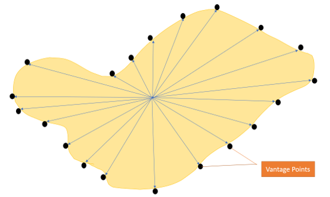

# Structure of the code:

 
## ProbeLatLon Class 

This part is concerned with changing the cartesian coordinates from the depth map png image to the actual coordinates of the moon. This function takes in the depth contour maps png image and then enables us to probe the image with respect to its latitude and longitude.

 

The above function converts the local coordinates to the latitude and longitude of the moon. The local_to_latlon function takes two parameters, x and y, which represents corresponding pixel values. Now, after shifting the origin, the respective latitude and longitude of the moon is computed, and the function returns those values. The constants defined and used for this function are as follows:

dtm_width, dtm_height: width and height of the depth map
(minlat, minlon), (maxlat, minlon): maximum and minimum values of latitude and longitude

The manageMouse method handles the screen coordinates and outputs the corresponding latitude and longitude values. The target landing site image is used as a texture on the main window for accurately depicting the exact latitude and longitude position.

## Map Class

	This class opens the depth maps provided by Jordan Ford, with the areas that are in radio line-of-site with the lander marked as green, the areas that are inside the  The loadFile() function then loads the desired image, and separates out the RGB values of each pixel. First it identifies the green pixels representing points that are in line-of-site (or LOS for short), updating the LOSmap accordingly. Then, it identifies the yellow pixels representing points that are in line-of-site (or LOS for short), updating the LOSmap accordingly. It uses the PitThreshold value to determine if the points are considered steep enough to be considered part of the pit. 
	These 2-dimensional boolean arrays, LOSmap and PitMap, are used instead of a single integer array to represent both, for the purposes of efficiency, as we will be processing hundreds of maps. 
	In the main file, we will go through all the images, creating a vector of Map objects. Each Map will have a LOSmap and PitMap variable, to be used by other functions. 

 

The above figure demonstrates the contour depth map of the surface of the moon alongside the pit. The blue circle represents the best landing site on the surface nearby the pit, necessarily avoiding the surfaces with higher slopes and viable line of sight between the rover and the lander. The product incorporates the use of A star algorithm, a path planning algorithm, where it decides the shortest possible path according to the heuristics, starting point and the ending point. 

 

From the figure above, the final product generates the following outputs:
a.	The Best Landing Site
b.	The Vantage points

Vantage Points → The vantage points indicate the best possible points for reconstructing the images of the pit These points are plotted considering all the aspects such as line of sight between the lander and the rover, surface slope, and the location of the pit considering the latitude-longitude data. We have implemented A* algorithm to navigate the path of the rover to the next vantage point considering the facts such as the location of the vantage point on an “island”, basically the location where the rover cannot navigate due to line of sight or slope constraints.

## Site Intersection 

	Based on the output we get from LOSmap all the maps for the various images will be stored in a vector. We create a new struct Pixel_state which will take care of the state of the pixel. Pixel_state refers to the color from which it was made. For example for LOSMap 0 is not-green 1 is green and for PitMap green is 0 and yellow is 1. Now to process this we check the same pixel (pixel– x,y value) value on the multiple images of the map that we have and take a count of how many times it occurs on each map. Based on the output for it we get the highestCount that any pixel has. Once we get the count we use the hsv2rgb from which can generate varying shades color of green rather than having just a single color by changing the saturation using the ratio of the count/highestCount and then use it as a input and generating corresponding RGB value to display the output as the collection of all maps into one which will show which points on the map are most accessible , which will be shown as the saturation the pixels with  the highest saturation will be the most accessible. 

## Vantage Points : 

 
We find the center of the pit using the coordinates from the slopeMap and then from the slope map. Once we have the we move around clockwise and mark the points around the pit where they intersect the outside the pit and they are covered under LOSMap (green shaded area).

## AStar:
After finding the vantage points we try to eliminate the points that are not accessible from the landing site (such as island type cases)

 

As can be seen from the image above the points that have been circled are surrounded by Red region ie. region that can not be accessed as is not in the line of site of the Lander. So, we run all the vantage points through the A star algorithm and try to find all the vantage points that can be accessed by the rover when starting from the landing site. Once we get an array of all these points together and then we can use it in future for further path planning and execution.

The A* algorithms take a lot of time(since this essentially becomes a 1995 by 1995 maze) so for demonstration purposes we are using just the Manhattan distance and assuming that all the vintage points are accessible. This is done to show the utility of the Auto Evaluator function which helps to evaluate the site based on various other parameters and then giving out the best map for the algorithm. We have shown that below with an example
    
From among the above 3 landing sites when we pass all the images we get the 3rd site as the best site which we can see from just visual confirmation as well that that landing site appears to be the best as all the vantage points are safely covered in the LOSMap and and the rover can close enough to the pit as well. So using the Auto Evaluator we will be able to get the best landing possibility of all the landing sites that might have been evaluated.

## AutoEvaluate Site:-
Below mentioned is the code structure and the inputs that we can use form the Map class object and use them to join 

### Inputs Required : Map object List with following attributes
1.	map.LOSintersection(double): total no of points in the landing site(blue circle) that give line of site score (on the path decided by Astar) above a particular threshold line of site score.( accounting for which landing site gives more room for error in landing position). 
2.	map.distToLander (double): distance of landing spot  to starting point on crater circumference. 
3.	map.percentVantagePoints (double) : score based  num  circumference sites accessible/ navigable  in current picture.
4.	lengthVantagePath(double) : total distance covered along circumference of crater to get sufficient photos for 3-D construction. (will sum with map.distToLander(double) to find cumulative distance for a better metric) ( min distance will circumference of crater. )

### Outputs:

1.	K Best Landing sites out of all the Possible Landing Sites. Based on a heuristic that minimizes lengthofPathsBetweenPoints, distance to Lander and maximizes LOSintersection Score and percentagePoints for some input image on which these parameters were computed. Nlog(k).

Problem Being Solved:
To analyze various possible landing sites and paths making sure to pick the site that gives us the most access to the crater for exploration, has the highest probability line-of-site coverage (e.g. 75% coverage is better than 25%), smallest distance to lander, easiest path between points around crater, etc. 
Procedure: Build a scoring function based on above parameters and generate the K best candidates for landing site.

Best Landing Site → It basically computes the coordinates of the best landing site. The blue circle depicted in the image is the uncertainty in the actual landing site of the rover. The green shades, red shades and the yellow shades represent the depth data of the moon surface. Green color indicates the slope is very low, or the surface is flat. Red zone indicates that the concerned area is not suitable for the communication between the rover and the lander, as they do not appear in a single line of sight. The yellow are depicts the actual pit under study.

The gridSearch evaluates the possible sites and gridSearchTargeted searches a particular site corresponding to the ( latitude and longitude ) or (Pixel x, y) as the function has been overloaded to accept either value.

Miscellaneous:

1.	The Mapwindow folder consists of the framework for future implementation of our plan to visualize the line of sight percentage, vantage points, possible paths, slope and length of paths to the vantage point.

2.	Link to Slides

3.	Steps to Run Code:
1.	Kindly open our project with Visual Studio using the open local folder option.
2.	Make sure that sitesearch.exe is selected and the file is run in x64-Release mode.

